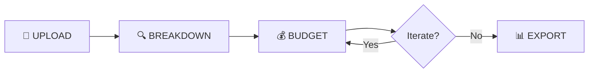

# 🎬 LEMON BUDGET ENGINE — Final Brainstorm

> *Screenplay → Breakdown → Schedule → Budget. For real Mexican productions.*

---

## Decisions Locked In

| Question | Answer |
|----------|--------|
| **Architecture** | Option C — Sister App (separate project, shared Firebase) |
| **AI Model** | Google Gemini |
| **Quick Budget mode?** | No — always require a script |
| **MVP Scope** | Upload → Breakdown → Budget (schedule can come later) |
| **Primary Language** | English-first, with ES/EN toggle |
| **MPI System** | Learning system — upload new budgets to expand pricing knowledge |
| **Integration** | One-way from Lemon Screenplay Dashboard → send screenplay to Budget Engine |
| **Brand** | Editorial Punk (Cyan/Yellow/Coral on Crosshatch Dark) |

---

## Brand Identity: Editorial Punk

| Element | Value |
|---------|-------|
| **Primary Accent** | Electric Cyan `#00E5C8` — CTAs, links, interactive elements |
| **Signal** | Signal Yellow `#FFFF00` — highlights, budget totals, emphasis |
| **Alert** | Coral Punch `#FF6B6B` — warnings, flags, over-budget items |
| **Background** | Crosshatch Dark `#2A2A2A` with texture overlay |
| **Deep BG** | `#0F0F0F` — page background |
| **Display Font** | Barlow Condensed 900 (headlines) |
| **Body Font** | Archivo 400 (paragraphs, UI) |
| **Mono Font** | Space Mono 400 (labels, budget numbers, metadata) |
| **Logo** | White on Crosshatch (primary digital) |

**Color Usage:** 50% Dark / 20% White / 15% Cyan / 10% Yellow / 5% Coral

### How Brand Maps to Budget App

| App Element | Brand Treatment |
|-------------|----------------|
| Sidebar + Nav | Crosshatch dark `#2A2A2A` with texture, Space Mono labels |
| Budget totals | Signal Yellow `#FFFF00` highlight blocks |
| Stripboard strips | Industry colors (White/Yellow/Blue/Green) with cyan borders |
| CTA buttons | Electric Cyan `#00E5C8` |
| Over-budget flags | Coral Punch `#FF6B6B` |
| Line-item tables | Archivo body, Space Mono for numbers |
| Page titles | Barlow Condensed 900 uppercase |
| Draft comparison diffs | Cyan (savings) / Coral (increases) |

---

## The 3 MVP Stations



### Station 1: Upload & Parse

- Drop screenplay PDF → AI extracts scenes, sluglines, page counts
- Set project: Title, Tier (Low/Mid/Premium), Location

### Station 2: Breakdown

- AI identifies production elements per scene (cast, props, SFX, locations...)
- Color-coded element tags (16 categories)
- Producer reviews, adds/removes elements inline

### Station 3: Budget

- MPI rates × quantities × shoot days = line items
- Fringe engine: IMSS 35%, ANDA 13%, OT 5-8%
- Draft versioning: save snapshots, compare side-by-side
- **Learning MPI**: upload past budgets → system absorbs new pricing data

---

## Learning MPI System

This is a key differentiator. The MPI isn't static — it grows:

1. **Base MPI** ships with 388 line items from 3 real Mexican budgets
2. **Upload Budget** feature lets producers feed in completed budgets (XLSX/CSV)
3. AI parses the uploaded budget, maps items to MPI categories
4. New rates are absorbed as additional data points (e.g., "B4: $31,200")
5. Over time, the MPI gets more accurate as more productions feed data back
6. Each MPI item shows: min, max, average, and number of data points

---

## Lemon Dashboard Integration

One-way flow only:

```
Lemon Screenplay Dashboard → "Budget This Script" button → Opens Budget Engine with screenplay data pre-loaded
```

- Dashboard sends: screenplay PDF URL, title, parsed scenes (if available)
- Budget Engine receives and starts at Station 1 with data pre-populated
- No backward integration — the apps are independent otherwise

---

## Tech Stack

| Layer | Choice |
|-------|--------|
| Framework | Vite 7 + React 19 |
| Language | TypeScript strict |
| Styling | Tailwind CSS 4 + brand tokens |
| State | Zustand 5 (client) + TanStack Query 5 (server) |
| Backend | Firebase (Firestore + Storage) |
| AI | Google Gemini API |
| Tables | TanStack Table v8 |
| Drag & Drop | @dnd-kit (for future stripboard) |
| Charts | Recharts 3 |
| PDF Parse | pdfjs-dist |
| PDF Export | @react-pdf/renderer |
| XLSX Export | ExcelJS |
